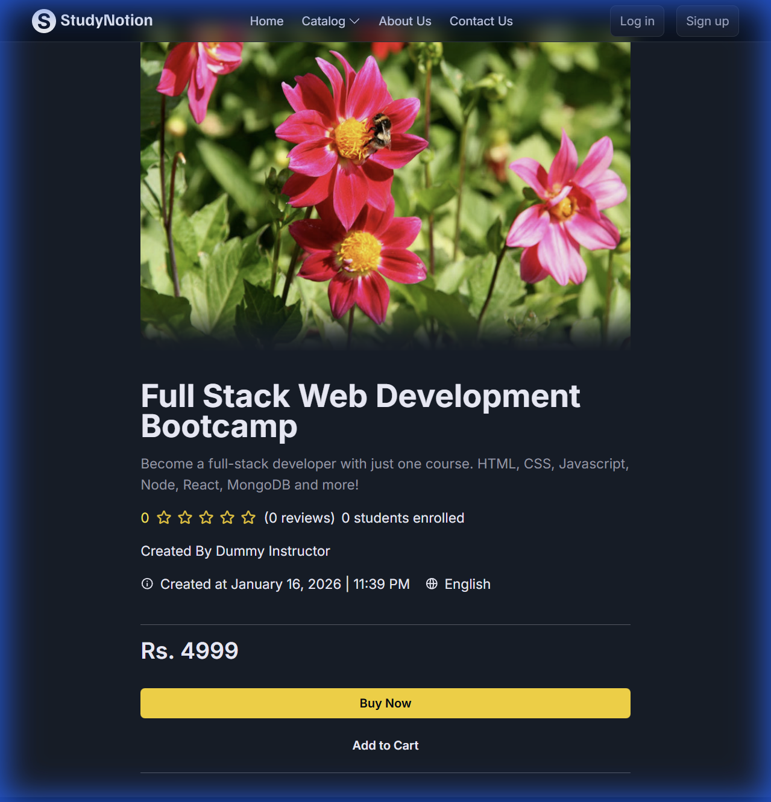

# StudyNotion - EdTech Platform 🚀

StudyNotion is a fully functional EdTech platform that enables users to create, consume, and rate educational content. The platform is built using the **MERN stack** (MongoDB, ExpressJS, ReactJS, NodeJS) and has been modernized with **Vite** and a **Premium UI/UX** design.


## 🌟 Key Features

-   **Student & Instructor Modes**: Seamless switching between learning and teaching roles.
-   **Course Management**: Instructors can create, edit, and publish courses with multimedia content.
-   **Payment Integration**: Secure course purchase flow using Razorpay.
-   **Rating & Reviews**: Real-time feedback system for courses.
-   **Premium UI/UX**:
    -   **Glassmorphism Navbar**: Modern, translucent navigation.
    -   **Dark Mode Aesthetic**: Sleek "Rich Black" and "Neon" color palette.
    -   **Animations**: Smooth page transitions and scroll reveals powered by **Framer Motion**.
-   **Performance**: Migrated to **Vite** for lightning-fast development and build times.

## 📸 Snapshots

### Course Details Page


## 🛠️ Tech Stack

| Category | Technologies |
| :--- | :--- |
| **Frontend** | ReactJS, Vite, Tailwind CSS, Framer Motion, Redux Toolkit |
| **Backend** | NodeJS, ExpressJS, Mongoose |
| **Database** | MongoDB |
| **Authentication** | JWT, OTP (Nodemailer) |
| **Payments** | Razorpay |
| **Cloud Storage** | Cloudinary |

## ⚡ Getting Started

Follow these instructions to set up the project locally.

### Prerequisites

-   Node.js (v18+)
-   MongoDB (Local or Atlas)

### Installation

1.  **Clone the repository**
    ```bash
    git clone https://github.com/Daksh54/StudyNotion-Edtech.git
    cd StudyNotion-Edtech
    ```

2.  **Install Frontend Dependencies**
    ```bash
    npm install
    ```

3.  **Install Backend Dependencies**
    ```bash
    cd server
    npm install
    ```

### Environment Variables

Create a `.env` file in the `server/` directory:

```env
# Server
PORT=4000
MONGODB_URL=mongodb://localhost:27017/studynotion

# Auth
JWT_SECRET=your_jwt_secret
MAIL_HOST=smtp.gmail.com
MAIL_USER=your_email
MAIL_PASS=your_email_password

# Payments (Razorpay)
RAZORPAY_KEY=your_key
RAZORPAY_SECRET=your_secret

# Cloudinary
CLOUD_NAME=your_cloud_name
API_KEY=your_api_key
API_SECRET=your_api_secret
```

### Running the App

**Option 1: Concurrent (Recommended)**
Run both frontend and backend with a single command from the root:
```bash
npm start
```

**Option 2: Separate Terminals**
*Frontend:*
```bash
npm run dev
```

*Backend:*
```bash
cd server
node index.js
```

## 🤝 Contributing

Contributions are welcome! Please open an issue or submit a pull request for any improvements.
